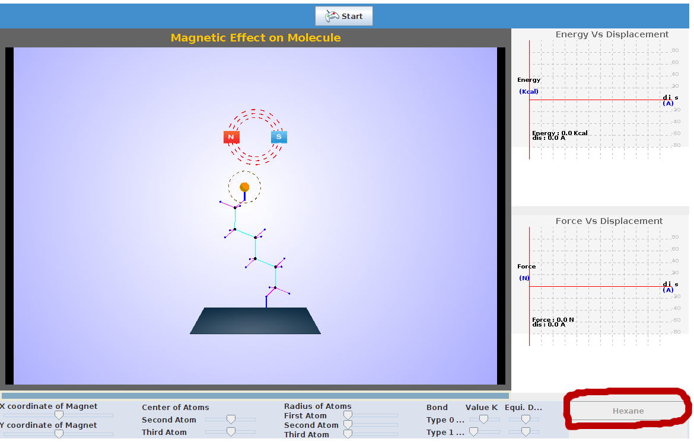
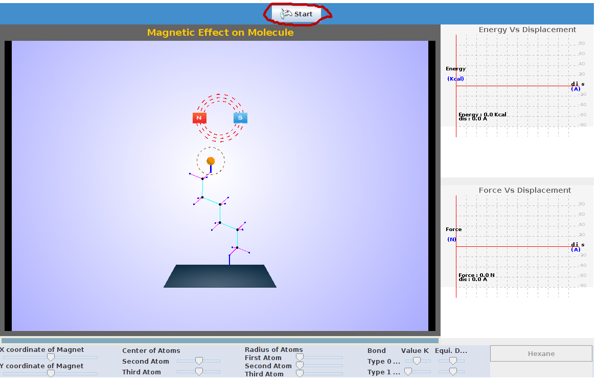
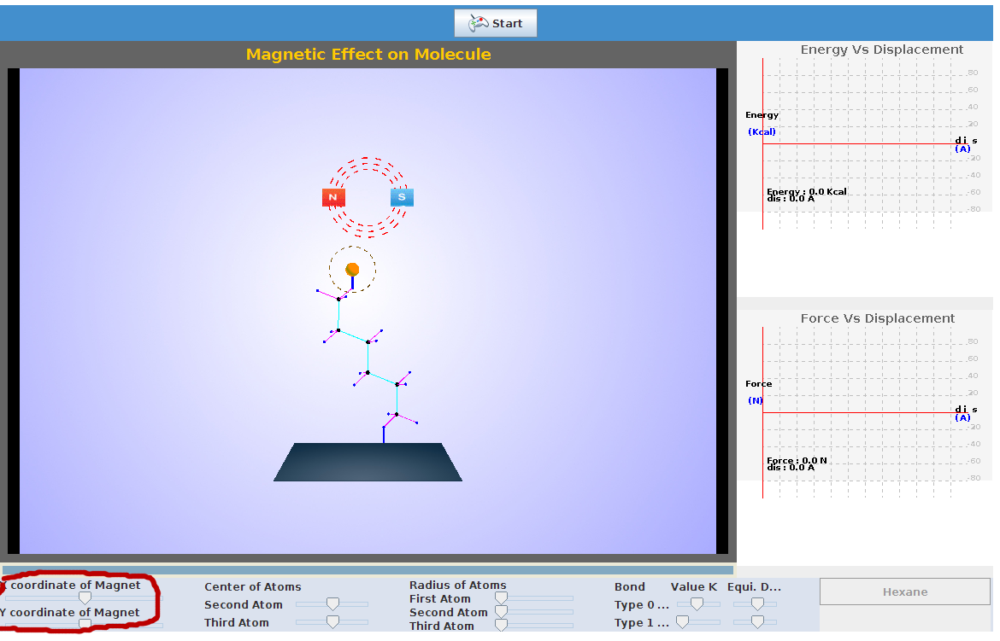
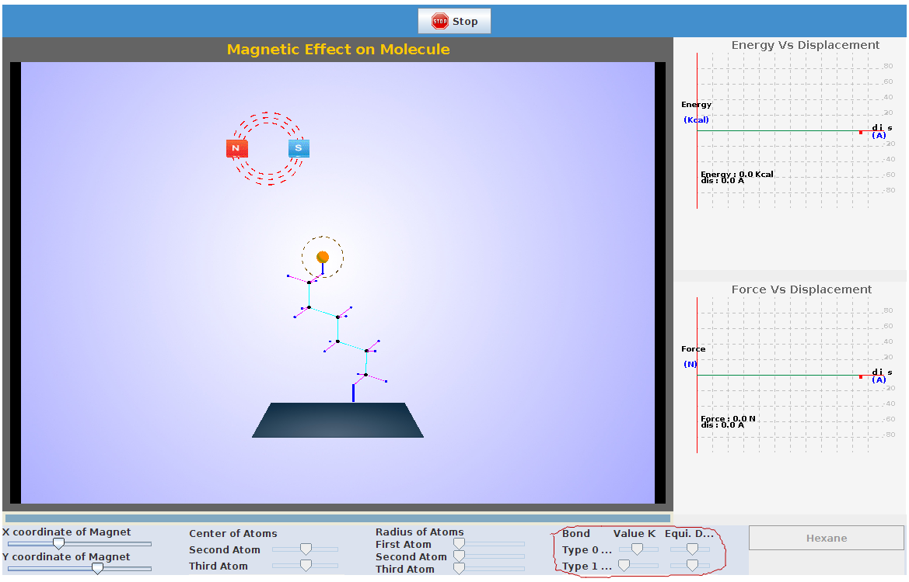

There are certain parameters to be initialized and the procedure detailed here can be followed.

STEP 1:Select the molecule .

STEP 2: Click on 'start' tab to initialize the experiment.

STEP 3: The coordinates of particles can be changed by changing the position of slider.

STEP 4: The force constant values can be varied by chaniging the position of sliders.

STEP 5: The plot of change in energy with respect to change in position of magnet coordinates is seen.

