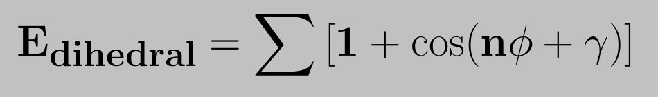
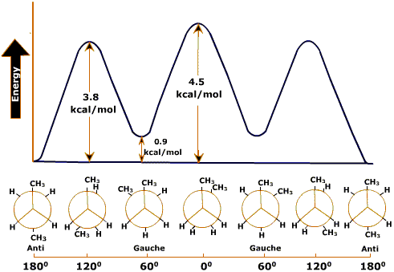

The standard functional form for representing the potential energy for a torsional rotation was introduced by Pitzer. The dihedral potential energy function is defined as,

This gives the value of energy barrier for rotation, n the number of maxima (or minima) in one full rotation and gamma determines the angular offset. The use of the sum allows for complex angular variation of the potential energy (in effect a truncated fourier series is used). Barriers for dihedral angle rotation can be attributed to the exchange interaction of electrons in adjacent bonds (see Pauling). The dihedral energy profile of ethane and butane are shown in the following figures.

  

Dihedral energy profile of ethane

Rotation about the C-C bond of ethane causes a change in the dihedral angle φ and consequently the distance between the end hydrogen atoms. If the distance between the two hydrogen atoms becomes short, the potential energy of the molecule will increase because the steric repulsion. When the dihedral angle φ = 00, 1200 and 2400, it becomes maximal; when the dihedral angle φ = 600, 1800 and 3000, it becomes minimal. Thus, the plot of φ and the potential energy will yield the dihedral angle-potential energy curve given in Figure above.Staggered conformation has less energy than ecllipsed conformer.The reasons for this strain is due to the slight repulsion between electron clouds in the carbon-hydrogen bonds as they pass by each other at close quarters in the eclipsed conformer. Calculations indicate that the inter-nuclear hydrogen hydrogen distance in the staggered conformer is 2.55 Å, but that this distance decreases to about 2.29 Å in the eclipsed conformer.

In the case of butane, however, two conformations are not enough to describe the features of the diagram. The dihedral angle of one of the eclipsed forms is φ = 00.This form is called **cis**. The dihedral angle of the other staggered form,is φ = 600. This form is called **gauche**. Gauche is intermediate between staggered and eclipsed. The other one with φ = 1800 is called **trans** or **Anti**. Because of the proximity of two methyl groups, eclippsed conformers have high energy than Trans or Anti respectively.

  

Dihedral energy profile of butane:

The lowest-energy conformation is the one in which the two large groups (methyls) are as far apart as possible -1800. This is called the Anti conformation. As rotation around the C2-C3 bond occurs, an eclipsed conformation is reached in which there are two methyl-hydrogen interactions and one hydrogen-hydrogen interaction. This eclipsed conformation is more strained than the anti conformation by 2 x 1.4 kcal/mol (two methyl-hydrogen interactions) plus 1.0 kcal/mol (one hydrogen-hydrogen interaction) or a total of 3.8 kcal/mol. When the rotation is continued, an energy minimum is reached at the staggered conformation where the methyl groups are 600 apart. This is called the gauche conformation, and it lies 0.9 kcal/mol higher in energy than the anti conformation even though there are no eclipsing interactions. This energy difference is due to the fact that the gauche conformation forces the large methyl groups to be near each other, resulting in steric strain.

**Note :** Steric strain is the repulsive interaction that occurs when two groups are forced to be closer to each other than their atomic radii allow; it is the result of trying to force two objects to occupy the same space.

